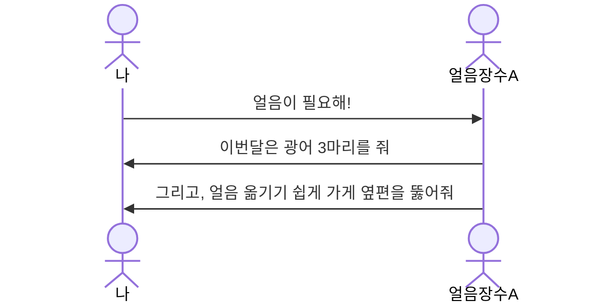
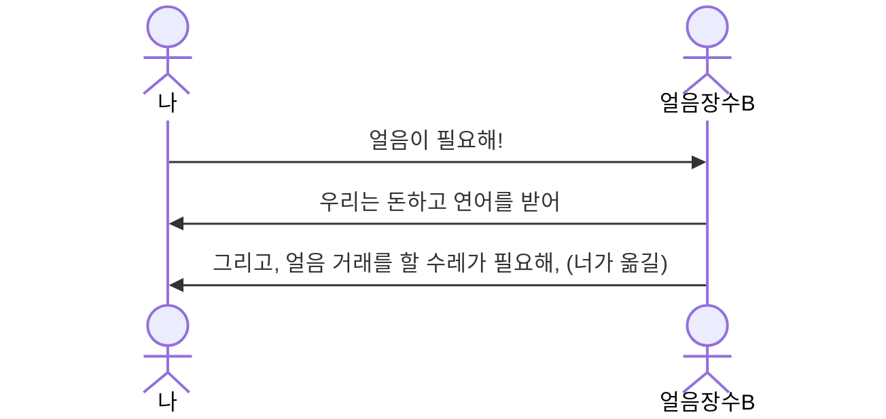
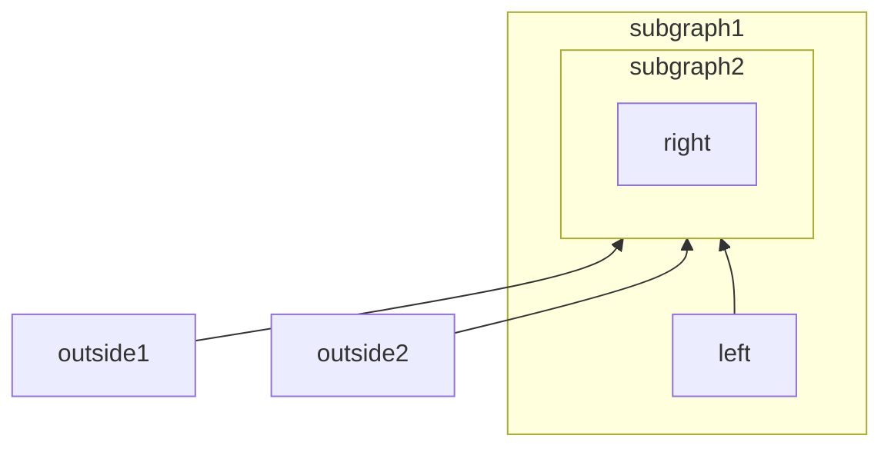
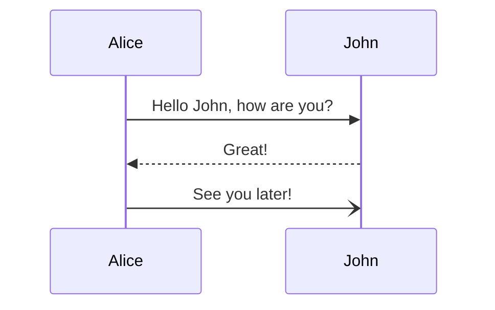

## 들어가며

오늘은 DIP의 개념에 대해 정리해보려고 한다. DIP(Dependency Inversion Principle)를 처음 들었을때는 고개가 끄덕여지면서 이해가 되는 듯 싶다가도 결국엔 갸우뚱하고 있는 나를 발견했었다. 그래서 최대한 예시를 많이 적용하여 DIP에 대한 개념을 정리해보려고 한다. 

## 얼음 구하기 

"언제 어디로든 가!" 문을 통과해 냉동고가 발달하기 이전의 이 세계로 들어가보자.

현재 나는 물고기를 잡아다 판매하는 어부다. 아침에 열심히 물고기를 사냥해서 돌아와 마을 주민들에게 생선을 판매하려고 한다. 하지만 생선의 신선도를 유지하기는 그리 호락호락하지 않았다.

예를 들면, 생선이 상하지 않게 보관을 하려면 다음과 같은 단계들이 필요했다. 
- 생선을 손질하기 
- 얼음을 이용해 낮은 온도 유지하기  

그래서 나는 이러한 단계들을 "**생선 보관하기**"라고 이름 붙였다. 

이 단계들 중 생선을 손질하고 보관하는 것은 내가 어떻게든 할 수 있었는데, 중요한 것은 **얼음을 직접 만드는 것**이 쉽지가 않다는 것이었다. 그래서 마을의 여러 얼음장수들을 컨택해보는데.. 처음 만난 얼음장수 A와 얼음 거래를 하기 위해서는 다음과 같은 요구사항들을 만족해야만 했다. 

"뭐 이렇게 요구하는게 많아.."하면서 다른 얼음장수 B를 찾아가는데 요구하는 요구사항이 A와는 또 확연히 달랐다. 

울며겨자 먹기로 얼음장수 A와 거래를 택하고, 얼음을 공급받기 위해 
- 잡은 물고기 중 **광어 3마리**를 우선적으로 제외하고, 
- 가게 **옆편을 커스터마이징**하여 얼음을 공급받을 장소를 만들었다.

그렇게 장사를 이어가던 도중 얼음장수 A가 광어를 3마리에서 4마리로 올리자, 얼음 공급 업체를 바꿔버리고 싶은 욕구가 불쑥 튀어나왔지만, 현재는 얼음장수 A의 요구에 맞게 가게 구조도 변경했고, 다른 얼음 장수가 원하는 요구사항을 맞추려면 그들이 원하는 방식에 또 맞춰야하는 비용이 많이 발생하기 때문에 선뜻 변경하기가 쉽지 않았다.

그 장면을 오랫동안 봐왔던 사업가는 한 가지 사업아이템을 떠올리는데, **얼음을 구하는** 데 필요한 수단을 돈으로 통일하고, 얼음을 수레로 배달하는 방식으로 나 같은 어부들의 불편함을 해소해주는 사업이었다.

몇일 후 사업가는 `ICE Dispenser`라는 업체의 명함을 들고 찾아와 제휴를 제안했는데, 이 소식을 들은 나는 속이 뻥뚤리는 기분이었다. 앞으로는 정해진 방식으로 얼음 대가를 지불하면되고, 가게를 얼음장수의 요구에 맞게 변경할 필요도 없어졌기 때문이다. 그저 `ICE Dispenser` 에 얼음이 필요하다고 요청하고, 받기만 하면 끝이기 때문이었다. 별도의 공간을 만들거나, 새로운 수레를 사거나 할 필요가 없어졌다.

## 고수준 모듈과 저수준 모듈 

여기서 고수준 모듈은, 의미 있는 단위 기능을 제공하는 모듈이다. 그리고 이러한 기능을 제공하기 위해 필요한 하위 기능들을 저수준 모듈이라고 부른다. 

고수준과 저수준은 상대적인 개념으로 볼 수 있다. 

일반적으로는 고수준 모듈을 구현하기 위해 하위에 저수준 모듈들이 위치하게 되는데, 때문에 고수준 모듈이 저수준 모듈의 동작 방식을 자세하게 알게될 수 밖에 없다. 다음 코드를 확인해보자

사실 생선가게 입장에서는 땅을파서 얼음을 구하던, 동굴에가서 얼음을 구하던, 얼음을 구하는 세부 구현 방식에는 큰 관심이 없다. 그저 돈주고 원하는 양을 얻을 수 있느냐가 중요한것이다. 

그렇게 되면 이전에는 생선 가게가 얼음 가게를 의존하고 있었다면, 이제는 더이상 그렇지 않다. 얼음 가게들이 얼음을 공급하는 방식을 ~~ 라는 인터페이스 방식을 구현하고 있으므로, 저수준에서 고수준 모듈로 의존방향이 변경되었다. 

그래서 이를 의존 역전 원칙이라고 부른다. 

### 장점

## 마무리
