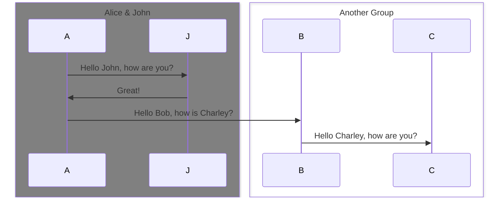
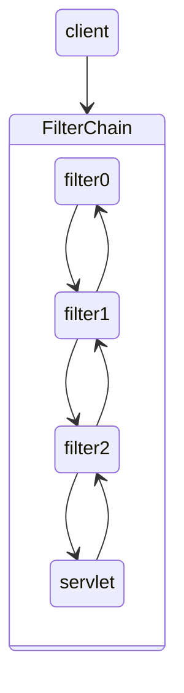
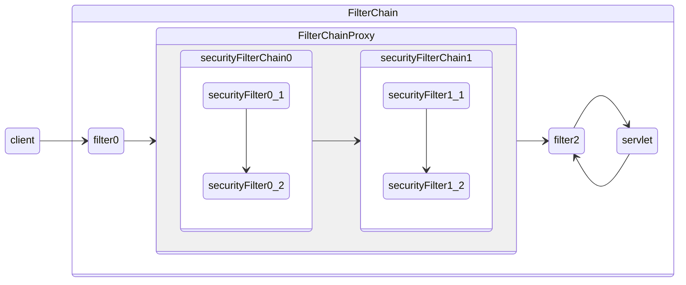

주제: 
- 인증과 인가의 이해 
- 스프링 시큐리티가 아키텍쳐 & 동작원리
- 필터 종류와 config 방법
## 들어가며

Spring Secuity는 강력하고 유연한 인증을 구현하도록 도와주는 접근 제어 프레임워크다. 사실상 Spring 기반 어플리케이션의 보안 표준으로 사용되고 있다. 

스프링 시큐리티 소개에 들어가보면 다음과 같은 소개말이 있다.
> Spring Security is a framework that focuses on providing both **authentication** and **authorization** to Java applications. 

읽어보면 스프링 시큐리티는 authentication과 authorization를 제공하는데 집중하는 프레임워크라는데, authentication과 authorization는 무엇이고 어떻게 다른걸까? 

그리고 스프링 시큐리티는 이 둘을 어떻게 제공할까?

## 인증 Authentication

### 인증이란?
인증은 "당신 누구야?" 이다. 

새로운 서비스에 가입하면 빠지지 않는 것이 바로 "본인 인증" 과정이다.   
실제로 내가 누군지, 서비스를 이용할 수 있는 사람인지 확인하는 절차이다. 

중요한 것은 단순히 서비스 이용 맨 앞단에 있는 "로그인"뿐만 아니라 다른 기능을 사용하는데 있어서도 인증은 필요한 단계다. 

### 인증 목적
인증의 목적은 간단하다. 원하지 않는 사용자를 거르기 위해서이다. 내가 초대하지 않은 사람이 나의 건물에 와서 이것저것 뒤지고 다닌다면, 엄청난 손해를 보기 때문이다. 

### 인증 방법

웹 서비스에서 사용자를 인증하는 방법 중 제일 심플하게 생각해볼 수 있는 것은 매 요청마다, 사용자가 누군지 물어보는 것이다. 

건물에 들어가는 것에 비유해보자 
맨 처음 건물에 들어갈때 누군지 검사하는 것 뿐만아니라, 화장실 갈때, 엘레베이터를 탈 때, 물 마실때마다 당신이 누군지 물어본다면 매번 확실한 인증을 수행할 수 있다. 

---

## 인가 Authorization

인가는 "당신 이거 쓸 수 있어?" 이다. 특정 **리소스나 기능**에 접근할 수 있는 **권한**이 있는지를 확인하는 절차다. 

인증이 된 사용자를 대상으로 사용자별로 할 수 있는 행동과 없는 행동을 지정해야할 요구사항이 자연스럽게 생기게된다. 

건물 입구에서 들어왔지만, 때로는 건물과 관련된 특정 사람들만 사용하도록 제한해야할 일들이 필요할 것이다. 예를 들어 건물의 전력, 수도, 환기 관련된 관제실에 모든 사람들이 접근해서 마구 버튼을 누를 수 있다면, 유사시에 
건물에 있는 모든 인원들이 위험에 빠질 수도 있을 것이다.

### 인가 목적

인가의 목적도 간단하다. 접근 범위를 제한하기 위해서다. 

### 인가 방법

사용자의 autorize와, autorize가 접근할 수 있는 자원과 그렇지 않은 자원을 정책적으로 분리해두는 방법이 있을 것이다. 

## Spring Security란

## 아키텍쳐

스프링 시큐리티는 기본적으로 서블릿 필터의 동작 방식에 기인한다.
다음 그림은 HTTP 요청을 다루는 레이어를 표현한 그림이다. 

- 클라이언트가 애플리케이션에 요청을 보내면 컨테이너는 HttpServletRequest 요청을 처리할 Filter Chain을 생성한다.
- FilterChain의 구성은 Filter 인스턴스와, 요청을 핸들링하는 Servlet 인스턴스를 포함한다.

Spring MVC에서는 Servlet은 DispatchServlet의 인스턴스를 의미한다. 기본적으로 하나의 서블릿은 한개의 HttpServletRequest 와 HttpServletResponse 를 처리할 수 있지만, 필터는 여러개가 사용될 수 있다. 
- Filter는 스트림의 성격을 가지기 때문에, 필터의 순서가 중요하다. 앞의 필터에 따라 뒤의 필터에 영향이 가기 때문이다.

## FilterChain과 SecurityFilter
스프링 시큐리티는 이러한 필터의 특성을 활용하여 적절한 보안 기능들을 지원한다.

바로 보안을 담당해주는 `FilterChainProxy` 라는 특수 필터를 사용한다. 마치 공기청정기에 헤파필터 같은 느낌에 해당된다. 이제부터 기본 Filter 역할이 아닌 보안을 담당하는 Filter를 `Security Filter` 라고 부른다.

`FilterChainProxy` 필터는 빈으로 등록되며 내부적으로 `SecurityFilterChain` 가지는데, 이 Chain을 을 통해 보안 필터를 거쳐가도록 도와준다. `SecurityFilterChain`의 역할은 현재 요청에 대해 어떤 `Security Filter` 가 적용되어야 하는지 알려주는 역할을 한다. 

Filter의 종류에는 다음과 같은 필터가 있다. 

	24.06.23 필터의 종류에 대해서 쓰다가 종료, 필터의 종류, Chain 등록 예시코드를 추가해야함. 
	인증과 관련된 필터, 인가와 관련된 필터를 나누어 설명하는 것도 좋을듯. 
	그리고 예시 요구사항을 통해 어떻게 구현되는지 보여주고 글을 마무리하는 방향으로

## 예시 

요구사항 

## 마무리

- 인증은 당신이 누구인지 확인하는 과정이다.
- 인가는 

인증가 인가는 Spring Security의 개념들중 하나에 그치는 것이 아닌 Spring Security가 궁극적으로 이루고자하는 목표이다. 
